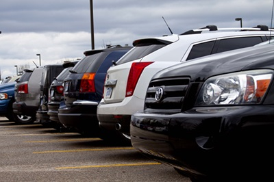
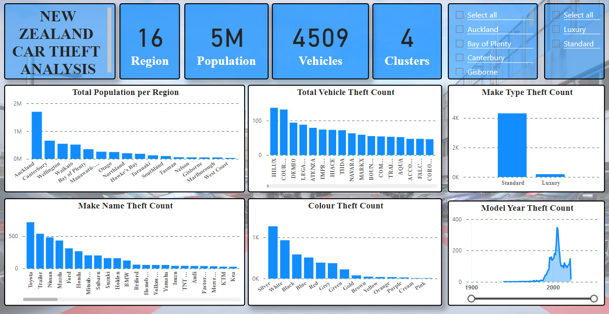
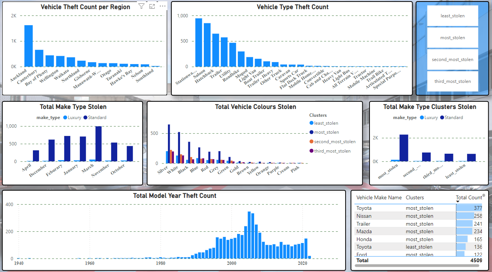
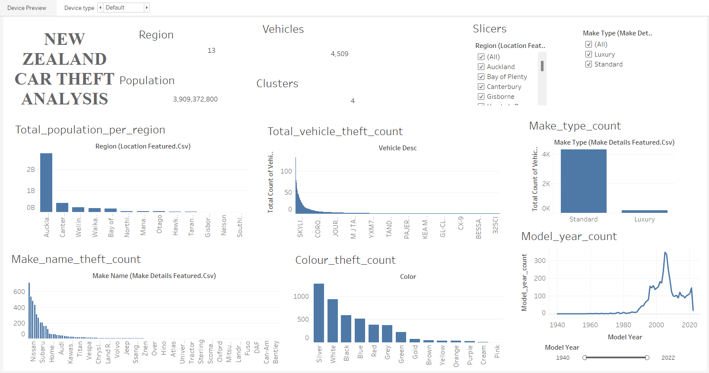
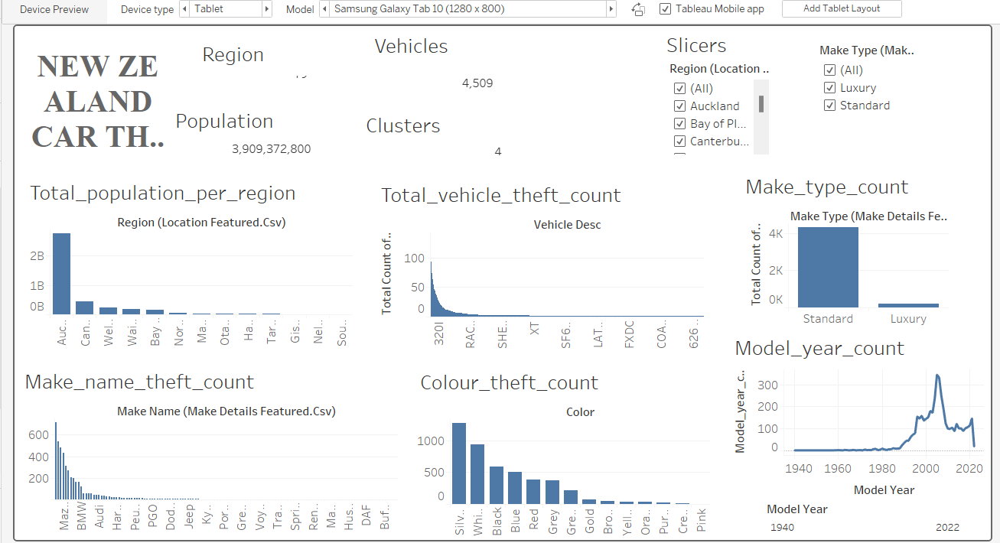
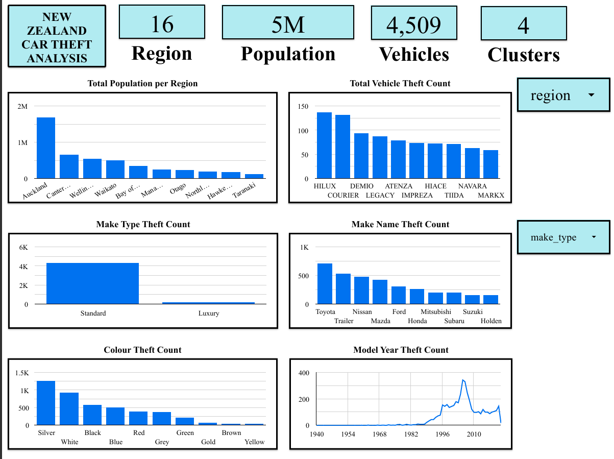
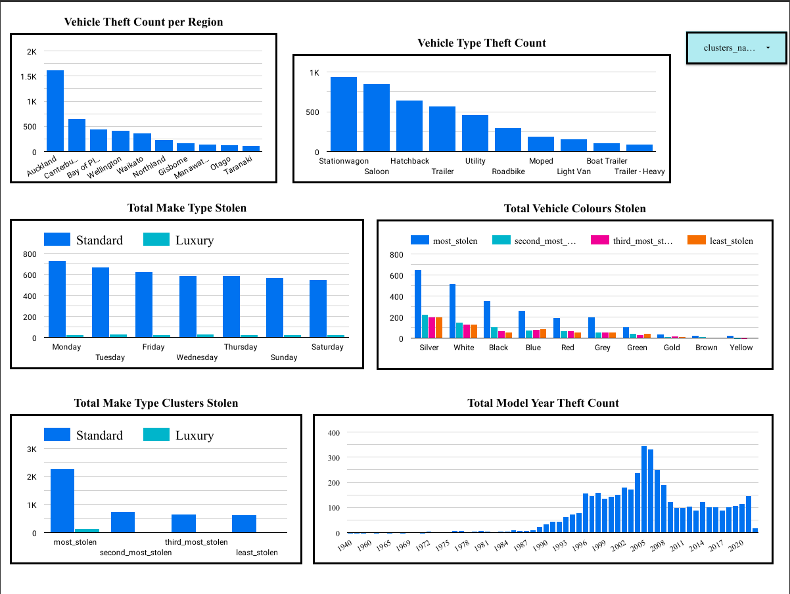

## **Motor Vehicles Theft Analysis**

This project was accomplished using Python programming language & Microsoft PowerBI. 

The following was observed during analysis;

### **Observations**

- The standard version of Stationwagon is mostly stolen more than the luxury version
- Across all vehicle types, 2022 shows a high rate of car thefts.
- The top five vehicle types namely; Stationwagon, Saloon, Hatchback, Trailer and Utility have thefts above 100 in the month of March.
- Standard Vehicle models of year 2005 were more stolen in the year 2022 than 2021
- More standard vehicles were stolen across all regions with Auckland being the highest
- In the month of March, more vehicles were stolen across all regions with Auckland being the highest
- More vehicles were stolen in the year 2022 for all regions with Auckland being the highest

- Vehicle types in cluster 0 are the most stolen vehicle types with Stationwagon being the most stolen
- Vehicle make types in cluster 0 are the most stolen vehicles with Standard make types being stolen the most
- 2005 model cars in cluster 0 are the most stolen vehicles.
- Cars in cluster 0 across the years, are the most stolen vehicles
- Much cars are stolen in the month of March with cluster 0 being the highest across all months
- Cars in cluster 0 are the most stolen in the Auckland region
- Each region has one cluster type
- There are five regions which cluster 0

PowerBI visuals:

Tableau (visuals):
Below is some images from the Tableau implementation:

Desktop view

Samsung Galaxy Tab 10

Google Looker visuals:

Page 1

Page 2

### **Conclusion**

- Action should be taken to reduce car theft, especially in the month of March
- Seeing that there was a 73.4% increase in car theft in 2022, more security measures should be taken to address this issue.
- Action should be taken to reduce car thefts for those in cluster 0, because it's clear they are the most stolen vehicles; 2413 thefts.